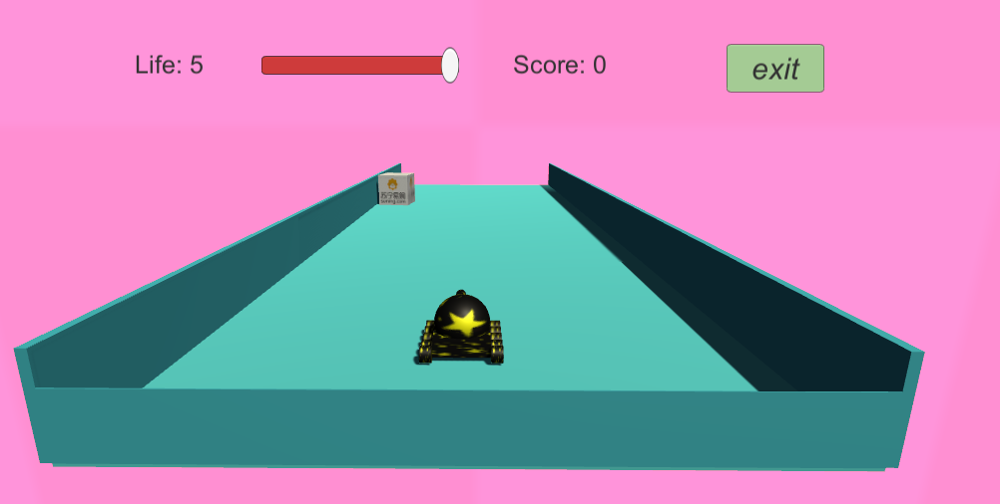

## 项目封面：

## 项目介绍

- 项目名称：Tank and box (坦克和盒子)
- 项目描述：游戏主要有5个场景，分别是开始登陆界面、菜单界面、游戏运行界面、游戏胜利界面、游戏失败界面。玩家需要通过操控键盘上的上下左右或WASD键对坦克进行移动，空格键进行开火以消灭迎面而来的盒子，每击中一个盒子加10分，同时坦克需要躲避盒子的碰撞否则Game Over，每当有一个盒子进入到坦克的领域生命值减1，共有5个生命值可消耗，当玩家分数达到100分游戏胜利！
- 开发周期：一个星期(2018.6.16~2018.6.22)
- 开发人员：个人独立完成
- 开发工具:   Unity3D +  visual studio2017

